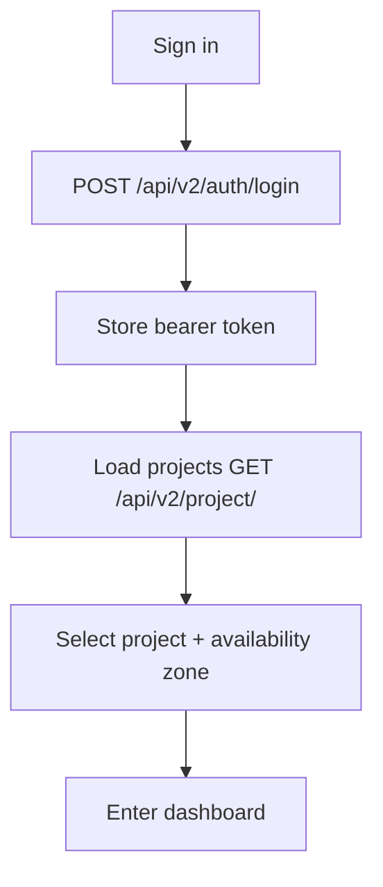
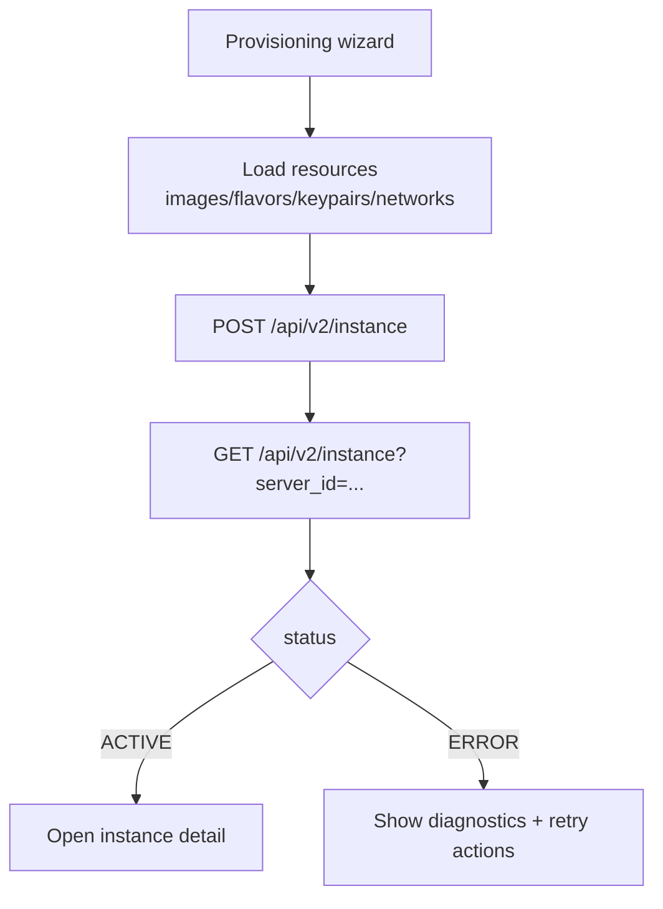
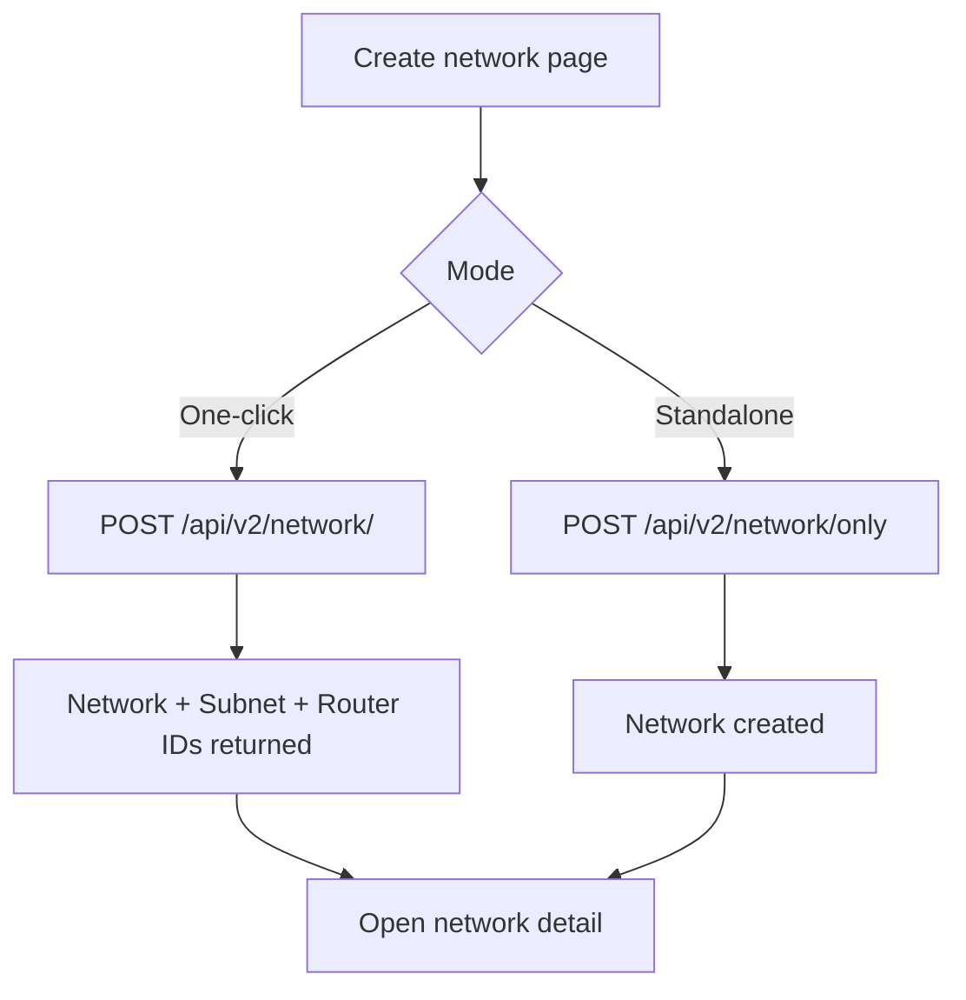
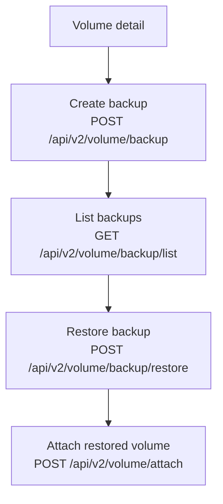

# Nobus v2 Frontend Implementation Playbook

## Objective
Implement the Nobus `/api/v2` cloud provisioning experience using the existing UniCloud frontend architecture, with explicit page coverage for the 40-page wireframe pack and minimal UI rework.

## Inputs
- Nobus OpenAPI: `api/app/Nobus/nobus.json`
- Wireframe pack: `/Users/mac_1/Downloads/nobus_wireframe_pack.pdf` (40 pages)
- Existing frontend app: `web/`

## What Already Exists (And Should Be Reused)

### Existing route shells and personas
- Client routes and page skeletons are already structured in `web/src/routes/ClientRoutes.tsx`.
- Tenant routes mirror client capabilities in `web/src/routes/TenantRoutes.tsx`.
- Shared page wrappers and dashboard shells already exist (`ClientPageShell`, `TenantPageShell`, shared layout components).

### Existing infrastructure UI containers
The app already has reusable infrastructure containers in `web/src/shared/components/infrastructure/containers/` for:
- Key pairs
- Subnets
- Security groups
- Elastic IPs
- Route tables
- Network interfaces
- VPCs

These containers already provide list views, action bars, modals, and permission gating by persona.

### Existing provisioning UX foundation
Instance provisioning is already implemented with reusable wizard steps:
- `web/src/clientDashboard/pages/ClientProvisioningWizard.tsx`
- `web/src/shared/components/instance-wizard/*`

This should be adapted to Nobus payloads instead of rebuilding provisioning UX from scratch.

## Recommended Integration Strategy

### Keep current app architecture, swap data adapters
Do **not** replace the UI. Add a Nobus data layer and map existing hooks/components to Nobus resources.

```mermaid
flowchart LR
  UI[Existing React UI\nClient/Tenant/Admin dashboards] --> H[Existing hook pattern\nReact Query + typed hooks]
  H --> A[New Nobus adapter layer\nrequest builders + response mappers]
  A --> B[Nobus API\n/api/v2/*]
  A --> C[Current backend facade\n/api/v1/* (optional transition)]
```

### Why this complements existing work
- Preserves all current navigation, role gating, and shell components.
- Preserves existing modals/tables/cards and reduces redesign risk.
- Limits change surface mostly to hooks/services and route additions for missing pages.
- Allows gradual rollout per feature domain (Compute, Network, Storage, Object Storage).

## Detailed Action Steps

---

### Phase 0: Contract & Client Setup

**Step 0.1 — Add Nobus base URL to environment**
- File: `web/.env` — add `VITE_NOBUS_API_BASE_URL=https://api.nobus.io`
- File: `web/src/config.ts` — add `nobusURL: import.meta.env.VITE_NOBUS_API_BASE_URL + '/api/v2'`

**Step 0.2 — Create Nobus HTTP client**
- File: **[NEW]** `web/src/services/nobus/nobusClient.ts`
- What it does:
  - Wraps `fetch` with automatic `Authorization: Bearer <token>` injection
  - Reads token from a Nobus-specific store (see Step 1.1)
  - Normalizes all Nobus responses (they return `{ status: bool, data: any }`)
  - Provides typed helpers: `nobusGet()`, `nobusPost()`, `nobusPut()`, `nobusDelete()`
- Pattern to follow: `web/src/services/objectStorageApi.ts` (same `resolveRequestContext` + `fetch` pattern)

**Step 0.3 — Create Nobus query param builder**
- File: **[NEW]** `web/src/services/nobus/queryBuilder.ts`
- What it does:
  - Converts filter objects into query strings
  - Handles Nobus-specific pagination params: `limit`, `marker`, `page_reverse`, `sort_key`, `sort_dir`
  - Strips `null`/`undefined` values automatically

**Step 0.4 — Create Nobus TypeScript types**
- File: **[NEW]** `web/src/types/nobus.ts`
- Define interfaces for:
  - `NobusInstance`, `NobusNetwork`, `NobusSubnet`, `NobusPort`, `NobusRouter`
  - `NobusFloatingIP`, `NobusSecurityGroup`, `NobusSecurityGroupRule`
  - `NobusVolume`, `NobusSnapshot`, `NobusBackup`
  - `NobusKeypair`, `NobusFlavor`, `NobusImage`
  - `NobusContainer`, `NobusProject`
  - Generic envelope: `NobusResponse<T> = { status: boolean; data: T }`

---

### Phase 1: Auth + Project Context

**Step 1.1 — Create Nobus auth store**
- File: **[NEW]** `web/src/stores/nobusAuthStore.ts`
- What it does:
  - Zustand store holding `nobusToken: string | null`
  - Methods: `setNobusToken(token)`, `clearNobusToken()`, `getNobusAuthHeaders()`
  - Persisted to localStorage under key `unicloud_nobus_auth`
- Pattern: mirror `clientAuthStore.ts` but only store the JWT

**Step 1.2 — Wire Nobus login to existing sign-in page**
- File: modify `web/src/dashboard/pages/loginV2.tsx`
- Action: after successful Laravel login, **also** call `POST /api/v2/auth/login` with `{ email, password }`
- Store returned `token` in `nobusAuthStore`
- The Nobus token is used for all `/api/v2/*` calls; the Laravel session cookie continues for `/api/v1/*`

**Step 1.3 — Create Project + AZ context store**
- File: **[NEW]** `web/src/stores/nobusContextStore.ts`
- State: `projectId: string | null`, `availabilityZone: string | null`, `projects: NobusProject[]`
- Methods: `setProject(id)`, `setAZ(zone)`, `loadProjects()` → calls `GET /api/v2/project/`
- Rule: every Nobus API call reads `projectId` + `availabilityZone` from this store

**Step 1.4 — Add context selector page**
- File: **[NEW]** `web/src/clientDashboard/pages/ClientContextSelector.tsx`
- Route: `/client-dashboard/context`
- UI: dropdown for project, dropdown for availability zone
- Redirects to `/client-dashboard` after selection

**Step 1.5 — Add context guard wrapper**
- File: **[NEW]** `web/src/components/NobusContextGuard.tsx`
- Wraps all compute/network/storage routes
- If `projectId` or `availabilityZone` is null → redirect to `/client-dashboard/context`
- Wire into `ClientRoutes.tsx` as a parent route element

---

### Phase 2: Compute (Instances, Keypairs, Images, Flavors)

**Step 2.1 — Create instance service**
- File: **[NEW]** `web/src/services/nobus/instanceService.ts`
- Methods (each calls Nobus directly):

| Method | HTTP | Endpoint |
|--------|------|----------|
| `listInstances(projectId, az, filters?)` | GET | `/instance/list` |
| `getInstance(projectId, az, serverId)` | GET | `/instance` |
| `createInstance(payload)` | POST | `/instance` |
| `deleteInstance(projectId, serverId, az, deleteVolume?)` | DELETE | `/instance` |
| `shutdownInstance(projectId, az, serverId)` | POST | `/instance/shutdown` |
| `rebootInstance(projectId, az, serverId, type)` | POST | `/instance/reboot-server` |
| `suspendInstance(projectId, az, serverId)` | POST | `/instance/suspend-instance` |
| `resumeInstance(projectId, az, serverId)` | POST | `/instance/resume-instance` |
| `lockInstance(projectId, az, serverId)` | POST | `/instance/lock-instance` |
| `unlockInstance(projectId, az, serverId)` | POST | `/instance/unlock-instance` |
| `resizeInstance(projectId, az, serverId, flavorId)` | POST | `/instance/resize` |
| `confirmResize(projectId, az, serverId)` | POST | `/instance/confirm-resize` |
| `revertResize(projectId, az, serverId)` | POST | `/instance/revert-resize` |
| `changePassword(projectId, az, serverId, newPass)` | POST | `/instance/change-server-password` |
| `clearPassword(projectId, az, serverId)` | POST | `/instance/clear-password` |
| `createServerImage(projectId, az, serverId, imageName)` | POST | `/instance/create-server-image` |
| `getConsoleOutput(projectId, az, serverId, length?)` | POST | `/instance/get-console-output` |
| `getConsoleUrl(projectId, az, serverId, consoleType)` | POST | `/instance/get-console-url` |
| `attachNetworkInterface(payload)` | POST | `/instance/attach-network-interface` |
| `detachNetworkInterface(payload)` | POST | `/instance/detach-network-interface` |
| `attachSecurityGroup(payload)` | POST | `/instance/attach-security-group` |
| `removeSecurityGroup(payload)` | POST | `/instance/remove-security-group` |
| `listNetworkInterfaces(projectId, az, serverId?)` | GET | `/instance/network-interfaces` |
| `getDiagnostics(projectId, az, serverId?)` | GET | `/instance/diagnostics` |
| `getSecurityGroups(projectId, az, serverId?)` | GET | `/instance/security-groups` |
| `getTags(projectId, az, serverId?)` | GET | `/instance/tags` |
| `setTags(projectId, az, serverId, tags[])` | POST | `/instance/set-tags` |
| `deleteTags(projectId, az, serverId, tag)` | POST | `/instance/delete-tags` |
| `getTopology(projectId, az, serverId?)` | GET | `/instance/topology` |
| `updateServer(payload)` | POST | `/instance/update-server` |

**Step 2.2 — Create instance React Query hooks**
- File: **[NEW]** `web/src/hooks/nobus/useNobusInstances.ts`
- Hooks to create (all using React Query):
  - `useNobusInstanceList(filters?)` → wraps `listInstances`
  - `useNobusInstance(serverId)` → wraps `getInstance`
  - `useCreateNobusInstance()` → mutation wrapping `createInstance`
  - `useDeleteNobusInstance()` → mutation
  - `useNobusInstanceAction()` → generic mutation for shutdown/reboot/suspend/etc.
  - `useNobusInstanceDiagnostics(serverId)`
  - `useNobusInstanceNetworkInterfaces(serverId)`
  - `useNobusInstanceSecurityGroups(serverId)`
  - `useNobusInstanceTags(serverId)`
  - `useNobusConsoleUrl(serverId, type)` → mutation
- Pattern: follow `web/src/hooks/storageHooks.ts`

**Step 2.3 — Wire existing instance list page**
- File: modify `web/src/clientDashboard/pages/ClientInstances.tsx`
- Swap from current hooks to `useNobusInstanceList()`
- Ensure table columns match `NobusInstance` fields: `id`, `name`, `status`, `key_name`, `created`, `addresses`

**Step 2.4 — Wire provisioning wizard**
- File: modify `web/src/hooks/useClientProvisioningLogic.ts`
- Replace resource-fetching calls with:
  - Images: `GET /api/v2/image/` → `useNobusImages()`
  - Flavors: `GET /api/v2/flavor/` → `useNobusFlavors()`
  - Keypairs: `GET /api/v2/keypair/` → `useNobusKeypairs()`
  - Networks: `GET /api/v2/network/list` → `useNobusNetworks()`
- Replace create call with `POST /api/v2/instance` via `useCreateNobusInstance()`

**Step 2.5 — Wire instance detail page + actions**
- File: modify `web/src/dashboard/pages/InstanceDetails.tsx`
- Add action buttons calling `useNobusInstanceAction()`:
  - Primary: Start, Shutdown, Reboot (soft/hard toggle)
  - Secondary: Suspend, Resume, Lock, Unlock
  - Modals: Resize (flavor picker), Change Password, Create Image, Update Name
  - Danger: Delete (with "delete volumes" checkbox)
- Add tabs using detail hooks: Network Interfaces, Security Groups, Tags, Diagnostics, Topology

**Step 2.6 — Create keypair service + hooks**
- File: **[NEW]** `web/src/services/nobus/keypairService.ts`
  - `listKeypairs(projectId, az)` → `GET /api/v2/keypair/`
  - `createKeypair(payload)` → `POST /api/v2/keypair/`
  - `deleteKeypair(keypairId, projectId, az)` → `DELETE /api/v2/keypair/`
- File: **[NEW]** `web/src/hooks/nobus/useNobusKeypairs.ts`

**Step 2.7 — Create image + flavor hooks**
- File: **[NEW]** `web/src/services/nobus/imageService.ts` → `GET /api/v2/image/`
- File: **[NEW]** `web/src/services/nobus/flavorService.ts` → `GET /api/v2/flavor/`
- File: **[NEW]** `web/src/hooks/nobus/useNobusImages.ts`
- File: **[NEW]** `web/src/hooks/nobus/useNobusFlavors.ts`

**Step 2.8 — Add console viewer page**
- File: **[NEW]** `web/src/clientDashboard/pages/ClientInstanceConsole.tsx`
- Route: `/client-dashboard/instances/:id/console`
- Calls `POST /instance/get-console-url` with `console_type: "novnc"`, embeds returned URL in an `<iframe>`

---

### Phase 3: Networking

**Step 3.1 — Create network service**
- File: **[NEW]** `web/src/services/nobus/networkService.ts`
- Methods:

| Method | Endpoint | Used by |
|--------|----------|---------|
| `listNetworks()` | `GET /network/list` | Networks page |
| `getNetwork()` | `GET /network/` | Network detail |
| `createNetwork()` | `POST /network/` | Quick create (network+subnet+router) |
| `createStandaloneNetwork()` | `POST /network/only` | Advanced create |
| `updateNetwork()` | `PUT /network/` | Edit modal |
| `deleteNetwork()` | `DELETE /network/` | Delete action |
| `listSubnets()` | `GET /network/subnet/list` | Subnets page |
| `createSubnet()` | `POST /network/subnet` | Create modal |
| `updateSubnet()` | `PUT /network/subnet` | Edit modal |
| `deleteSubnet()` | `DELETE /network/subnet` | Delete action |
| `listPorts()` | `GET /network/port/list` | Ports page |
| `createPort()` | `POST /network/port` | Create modal |
| `updatePort()` | `PUT /network/port` | Edit modal |
| `deletePort()` | `DELETE /network/port` | Delete action |
| `setPortAddressPairs()` | `POST /network/port/address-pairs` | Port detail |
| `clearPortAddressPairs()` | `POST /network/port/clear-address-pairs` | Port detail |
| `listRouters()` | `GET /network/router/list` | Routers page |
| `createRouter()` | `POST /network/router` | Create modal |
| `updateRouter()` | `PUT /network/router` | Edit modal |
| `deleteRouter()` | `DELETE /network/router` | Delete action |
| `addRouterInterface()` | `POST /network/router/add-interface` | Router detail |
| `removeRouterInterface()` | `DELETE /network/router/remove-interface` | Router detail |
| `clearRouterGateway()` | `DELETE /network/router/clear-gateway` | Router detail |
| `listFloatingIPs()` | `GET /network/floating-ip/list` | Floating IPs page |
| `createFloatingIP()` | `POST /network/floating-ip` | Create modal |
| `updateFloatingIP()` | `PUT /network/floating-ip` | Associate modal |
| `deleteFloatingIP()` | `DELETE /network/floating-ip` | Delete action |
| `disassociateFloatingIP()` | `GET /network/floating-ip/disassociate` | Inline action |
| `listSecurityGroups()` | `GET /network/security-group/list` | SG page |
| `createSecurityGroup()` | `POST /network/security-group` | Create modal |
| `updateSecurityGroup()` | `PUT /network/security-group` | Edit modal |
| `deleteSecurityGroup()` | `DELETE /network/security-group` | Delete action |
| `listSGRules()` | `GET /network/security-group-rule/list` | SG Rules page |
| `createSGRule()` | `POST /network/security-group-rule` | Create modal |
| `deleteSGRule()` | `DELETE /network/security-group-rule` | Delete action |
| `listTrunks()` | `GET /network/trunk/list` | Trunks page |
| `createTrunk()` | `POST /network/trunk` | Create modal |
| `updateTrunk()` | `PUT /network/trunk` | Edit modal |
| `deleteTrunk()` | `DELETE /network/trunk` | Delete action |
| `listQosPolicies()` | `GET /network/qos-policy/list` | QoS page |
| `createQosPolicy()` | `POST /network/qos-policy` | Create modal |
| `updateQosPolicy()` | `PUT /network/qos-policy` | Edit modal |
| `deleteQosPolicy()` | `DELETE /network/qos-policy` | Delete action |
| `listFirewallGroups()` | `GET /network/firewall-group/list` | Firewall page |
| `createFirewallGroup()` | `POST /network/firewall-group` | Create modal |
| `updateFirewallGroup()` | `PUT /network/firewall-group` | Edit modal |
| `deleteFirewallGroup()` | `DELETE /network/firewall-group` | Delete action |

**Step 3.2 — Create network hooks**
- File: **[NEW]** `web/src/hooks/nobus/useNobusNetworks.ts` — hooks for networks, subnets, ports
- File: **[NEW]** `web/src/hooks/nobus/useNobusRouters.ts` — hooks for routers + interfaces
- File: **[NEW]** `web/src/hooks/nobus/useNobusFloatingIPs.ts`
- File: **[NEW]** `web/src/hooks/nobus/useNobusSecurityGroups.ts`
- File: **[NEW]** `web/src/hooks/nobus/useNobusTrunks.ts`
- File: **[NEW]** `web/src/hooks/nobus/useNobusQosPolicies.ts`
- File: **[NEW]** `web/src/hooks/nobus/useNobusFirewallGroups.ts`

**Step 3.3 — Remap existing pages**
- `ClientSubnets.tsx` → swap hooks to `useNobusSubnets()`
- `ClientSecurityGroups.tsx` + `ClientSecurityGroupRules.tsx` → swap to Nobus SG hooks
- `ClientElasticIps.tsx` → remap to `useNobusFloatingIPs()` (Elastic IP = Floating IP in Nobus)
- `ClientNetworkInterfaces.tsx` → remap to `useNobusPorts()`

**Step 3.4 — Add new pages**
- **[NEW]** `ClientNetworks.tsx` → list networks, create/edit/delete modals
- **[NEW]** `ClientRouters.tsx` → list routers, detail with interfaces/gateway
- **[NEW]** `ClientFloatingIPs.tsx` (or reuse elastic IPs page with Nobus data)
- **[NEW]** `ClientPorts.tsx`
- **[NEW]** `ClientTrunks.tsx`
- **[NEW]** `ClientQosPolicies.tsx`
- **[NEW]** `ClientFirewallGroups.tsx`

---

### Phase 4: Block Storage

**Step 4.1 — Create volume service**
- File: **[NEW]** `web/src/services/nobus/volumeService.ts`
- Methods:

| Method | Endpoint |
|--------|----------|
| `listVolumes()` | `GET /volume/list` |
| `getVolume()` | `GET /volume/` |
| `createVolume()` | `POST /volume/` |
| `updateVolume()` | `PUT /volume/` |
| `deleteVolume()` | `DELETE /volume/` |
| `attachVolume()` | `POST /volume/attach` |
| `detachVolume()` | `POST /volume/detach` |
| `extendVolume()` | `POST /volume/extend` |
| `listSnapshots()` | `GET /volume/snapshot/list` |
| `getSnapshot()` | `GET /volume/snapshot` |
| `createSnapshot()` | `POST /volume/snapshot` |
| `deleteSnapshot()` | `DELETE /volume/snapshot` |
| `listBackups()` | `GET /volume/backup/list` |
| `getBackup()` | `GET /volume/backup` |
| `createBackup()` | `POST /volume/backup` |
| `deleteBackup()` | `DELETE /volume/backup` |
| `restoreBackup()` | `POST /volume/backup/restore` |
| `listAvailabilityZones()` | `GET /volume/availability_zone/list` |
| `listVolumeTypes()` | `GET /volume/volume_type/list` |
| `getVolumeType()` | `GET /volume/volume_type` |
| `createVolumeType()` | `POST /volume/volume_type` |
| `deleteVolumeType()` | `DELETE /volume/volume_type` |
| `listVolumeTransfers()` | `GET /volume/volume_transfer/list` |
| `createVolumeTransfer()` | `POST /volume/volume_transfer` |
| `deleteVolumeTransfer()` | `DELETE /volume/volume_transfer` |
| `acceptVolumeTransfer()` | `POST /volume/volume_transfer/accept` |
| `listConsistencyGroups()` | `GET /volume/consistency_group/list` |
| `getConsistencyGroup()` | `GET /volume/consistency_group` |
| `createConsistencyGroup()` | `POST /volume/consistency_group` |
| `updateConsistencyGroup()` | `PUT /volume/consistency_group` |
| `deleteConsistencyGroup()` | `DELETE /volume/consistency_group` |
| `listCGSnapshots()` | `GET /volume/consistency_group/snapshot/list` |
| `createCGSnapshot()` | `POST /volume/consistency_group/snapshot` |
| `deleteCGSnapshot()` | `DELETE /volume/consistency_group/snapshot` |

**Step 4.2 — Create volume hooks**
- File: **[NEW]** `web/src/hooks/nobus/useNobusVolumes.ts`
- File: **[NEW]** `web/src/hooks/nobus/useNobusSnapshots.ts`
- File: **[NEW]** `web/src/hooks/nobus/useNobusBackups.ts`
- File: **[NEW]** `web/src/hooks/nobus/useNobusVolumeTypes.ts`
- File: **[NEW]** `web/src/hooks/nobus/useNobusVolumeTransfers.ts`
- File: **[NEW]** `web/src/hooks/nobus/useNobusConsistencyGroups.ts`

**Step 4.3 — Add volume pages**
- **[NEW]** `ClientVolumes.tsx` → route: `/client-dashboard/storage/volumes`
- **[NEW]** `ClientVolumeDetail.tsx` → route: `/client-dashboard/storage/volumes/:id`
  - Tabs: Overview, Attachments, Snapshots, Backups
  - Actions: Attach, Detach, Extend, Create Snapshot, Create Backup, Delete
- **[NEW]** `ClientBackups.tsx` → route: `/client-dashboard/storage/backups`
- **[NEW]** `ClientVolumeTypes.tsx` → route: `/client-dashboard/storage/volume-types`
- **[NEW]** `ClientVolumeTransfers.tsx` → route: `/client-dashboard/storage/transfers`
- **[NEW]** `ClientConsistencyGroups.tsx` → route: `/client-dashboard/storage/consistency-groups`
- **[NEW]** `ClientCGSnapshots.tsx` → route: `/client-dashboard/storage/cg-snapshots`

**Step 4.4 — Remap existing snapshots page**
- `ClientSnapshots.tsx` → swap hooks to `useNobusSnapshots()`

---

### Phase 5: Object Storage (FOS)

**Step 5.1 — Create FOS service**
- File: **[NEW]** `web/src/services/nobus/fosService.ts`
- Methods:
  - `getAccountInfo(projectId)` → `GET /fos/account`
  - `createContainer(projectId, payload)` → `POST /fos/containers`
  - `deleteContainer(name, projectId)` → `DELETE /fos/containers`
  - `updateContainerMetadata(name, projectId, metadata)` → `PATCH /fos/containers/metadata`
  - `deleteObject(name, objectName, projectId)` → `DELETE /fos/containers/object`

**Step 5.2 — Wire existing pages**
- `ObjectStoragePage.tsx` → swap account fetch to `fosService.getAccountInfo()`
- `ObjectStorageCreate.tsx` → swap create to `fosService.createContainer()`
- `ClientObjectStorageDetail.tsx` → add metadata editor using `fosService.updateContainerMetadata()`
- Add delete object action using `fosService.deleteObject()`

**Step 5.3 — Handle missing list endpoint**
- The Nobus spec has no "list containers" endpoint
- Mitigation: cache container names client-side after create; provide "open by name" input field

---

### Phase 6: Routes + Hardening

**Step 6.1 — Update client routes**
- File: modify `web/src/routes/ClientRoutes.tsx`
- Add all new routes:
```
/client-dashboard/context
/client-dashboard/instances/:id/console
/client-dashboard/infrastructure/networks
/client-dashboard/infrastructure/routers
/client-dashboard/infrastructure/floating-ips  (or reuse elastic-ips)
/client-dashboard/infrastructure/ports
/client-dashboard/infrastructure/trunks
/client-dashboard/infrastructure/qos-policies
/client-dashboard/infrastructure/firewall-groups
/client-dashboard/infrastructure/flavors
/client-dashboard/storage/volumes
/client-dashboard/storage/volumes/:id
/client-dashboard/storage/backups
/client-dashboard/storage/volume-types
/client-dashboard/storage/transfers
/client-dashboard/storage/consistency-groups
/client-dashboard/storage/cg-snapshots
/client-dashboard/storage/availability-zones
```

**Step 6.2 — Add async polling for long operations**
- Create **[NEW]** `web/src/hooks/nobus/useNobusPolling.ts`
- Poll `GET /instance` or `GET /volume/` on interval until terminal status
- Terminal statuses: `ACTIVE`, `ERROR`, `available`, `error`, `in-use`
- Wire into instance create, resize, volume create, backup restore flows

**Step 6.3 — Add raw JSON fallback tabs**
- For all detail pages, add a "Raw JSON" tab that shows the raw Nobus API response
- Useful for fields not explicitly rendered in the UI

**Step 6.4 — Integration tests**
- Test auth flow → context selection → instance list → create → actions
- Test volume create → attach → snapshot → backup → restore
- Test network create (quick) → router → floating IP associate

**Step 6.5 — Feature flags**
- Add `VITE_ENABLE_NOBUS_V2=true|false` to `.env`
- Conditionally render Nobus routes and hooks based on flag
- Allows staged rollout without breaking existing v1 flows

## Core Flows

### Auth and context flow


### Instance provisioning flow


### Network setup flow


### Backup/restore flow


## 40-Page Wireframe Coverage Matrix

| Wireframe Page | Target Route | Existing Asset to Reuse | Nobus Endpoint(s) | Form/Data Requirements | Action |
| --- | --- | --- | --- | --- | --- |
| 1 Cover | docs only | N/A | N/A | N/A | No code |
| 2 Legend | docs only | N/A | N/A | N/A | No code |
| 3 Login | `/sign-in` | Existing auth page | `POST /api/v2/auth/login` | `email`, `password` | Remap auth call |
| 4 Context selector | new `/client-dashboard/context` | Existing project selectors + query patterns | `GET /api/v2/project/` (+ AZ source) | `project_id`, `availability_zone` | Add page/store/guard |
| 5 Dashboard | `/client-dashboard` | Existing dashboard widgets | list endpoints for instances/networks/volumes/fips | project+AZ scoped queries | Remap widgets to Nobus |
| 6 Compute Instances | `/client-dashboard/instances` | `SharedInstanceList` | `GET /api/v2/instance/list` | list filters from query params | Hook replacement |
| 7 Create Instance | `/client-dashboard/instances/provision` | existing provisioning wizard | `POST /api/v2/instance`, plus images/flavors/keypairs/networks | `CreateInstanceRequestSchema` fields | Payload mapper + validation |
| 8 Instance Detail | `/client-dashboard/instances/details` | existing detail shell | `GET /api/v2/instance` + action endpoints | `server_id`, project, AZ | Wire actions/polling |
| 9 Keypairs | `/client-dashboard/infrastructure/key-pairs` | `KeyPairsContainer` | `GET/POST/DELETE /api/v2/keypair/` | name/project/AZ | Remap keypair hooks |
| 10 Images | `/client-dashboard/infrastructure/images` | existing images page | `GET /api/v2/image/` | project+AZ | Remap list |
| 11 Flavors | new `/client-dashboard/infrastructure/flavors` | pattern from images page | `GET /api/v2/flavor/` | project+AZ | Add page + route |
| 12 Networks list | new `/client-dashboard/infrastructure/networks` | `VpcsContainer` or legacy `infraComps/Networks` | `GET /api/v2/network/list` | list filters | Add dedicated route + mapper |
| 13 Network create | modal or `/.../networks/create` | create modal patterns | `POST /api/v2/network/` and `/network/only` | network/subnet/router fields | Add create mode toggle |
| 14 Network detail | new `/.../networks/:id` | project detail panel pattern | `GET/PUT/DELETE /api/v2/network/` | `network_id` + updates | Add details page |
| 15 Subnets | `/client-dashboard/infrastructure/subnets` | `SubnetsContainer` | `GET/POST/PUT/DELETE /api/v2/network/subnet` + list | subnet schema fields | Remap subnet hooks |
| 16 Ports | new `/client-dashboard/infrastructure/ports` | network interface patterns | `GET/POST/PUT/DELETE /api/v2/network/port` + list | port schema fields | Add page/hooks |
| 17 Routers | new `/client-dashboard/infrastructure/routers` | route/IGW UX patterns | `GET/POST/PUT/DELETE /api/v2/network/router` + list | router schema fields | Add page/hooks |
| 18 Router detail | new `/.../routers/:id` | detail tabs pattern | router get + add/remove interface + clear gateway | router_id/subnet_id/port_id | Add detail/actions |
| 19 Floating IPs | `/client-dashboard/infrastructure/elastic-ips` | `ElasticIpsContainer` | `GET/POST/PUT/DELETE /api/v2/network/floating-ip` + list + disassociate | floating ip form fields | Remap to Nobus FIP model |
| 20 Security Groups | `/client-dashboard/infrastructure/security-groups` | `SecurityGroupsContainer` | `GET/POST/PUT/DELETE /api/v2/network/security-group` + list | SG name/desc/tags | Remap hooks |
| 21 SG Rules | `/client-dashboard/infrastructure/security-group-rules` | existing SG rules page | `GET/POST/DELETE /api/v2/network/security-group-rule` + list | direction/protocol/ports/cidr | Add create/delete on page |
| 22 Trunks | new `/client-dashboard/infrastructure/trunks` | container/table pattern | trunk CRUD + list | name, port_id, sub_ports | Add new page/hooks |
| 23 QoS Policies | new `/client-dashboard/infrastructure/qos-policies` | container/table pattern | qos-policy CRUD + list | name/shared/desc/tags | Add new page/hooks |
| 24 Firewall Groups | new `/client-dashboard/infrastructure/firewall-groups` | container/table pattern | firewall-group CRUD + list | name/policies/ports | Add new page/hooks |
| 25 Volumes | new `/client-dashboard/storage/volumes` | instance table/card patterns | `GET /api/v2/volume/list`, get/delete/update/create | volume filters | Add storage section routes |
| 26 Create Volume | new `/client-dashboard/storage/volumes/create` | wizard/form pattern | `POST /api/v2/volume/` | `VolumeCreateRequestSchema` | Add form + validation |
| 27 Volume Detail | new `/client-dashboard/storage/volumes/:id` | detail tabs pattern | get/attach/detach/extend/delete | volume_id/server_id | Add actions + status polling |
| 28 Snapshots | `/client-dashboard/infrastructure/snapshots` or new storage route | existing snapshots page | snapshot list/get/post/delete | volume_id/name/force/metadata | Remap/expand |
| 29 Backups | new `/client-dashboard/storage/backups` | snapshots table pattern | backup list/get/post/delete/restore | backup payload + restore payload | Add page/hooks |
| 30 Volume Types | new `/client-dashboard/storage/volume-types` | table+modal pattern | volume_type list/get/post/delete | name/is_public/extra_specs | Add page/hooks |
| 31 Transfers | new `/client-dashboard/storage/transfers` | table+modal pattern | volume_transfer list/get/post/delete/accept | transfer/auth key | Add page/hooks |
| 32 Consistency Groups | new `/client-dashboard/storage/consistency-groups` | table+detail pattern | consistency_group list/get/post/put/delete | cg fields | Add page/hooks |
| 33 CG Snapshots | new `/client-dashboard/storage/consistency-group-snapshots` | snapshots pattern | consistency_group snapshot list/get/post/delete | cgid + metadata | Add page/hooks |
| 34 Availability Zones | new `/client-dashboard/storage/availability-zones` | settings/list pattern | `GET /api/v2/volume/availability_zone/list` | project+AZ | Add simple info page |
| 35 Object Storage Account | `/client-dashboard/object-storage/:accountId` | existing object storage detail | `GET /api/v2/fos/account` | `project_id` | Remap account info query |
| 36 Containers | `/client-dashboard/object-storage` | existing object storage dashboard | create/delete container endpoints only in current spec | container cache + manual lookup | Keep UI, mark list limitation |
| 37 Create Container | `/client-dashboard/object-storage/create` | existing create page | `POST /api/v2/fos/containers` | `name`, `project_id`, `public` | Remap submit |
| 38 Container Metadata | new panel in object-storage detail | existing detail tabs | `PATCH /api/v2/fos/containers/metadata` | metadata key/value | Add metadata editor |
| 39 Delete Object | action in object-storage detail | existing object actions | `DELETE /api/v2/fos/containers/object` | `name`, `object_name`, `project_id` | Add delete-object form |
| 40 Closing page | docs only | N/A | N/A | N/A | No code |

## Nobus Form Mapping (Required for UI validation)

### Create Instance (`POST /api/v2/instance`)
Required:
- `project_id`
- `availability_zone`
- `name`
- `image`
- `flavor`
- `key_name`

Optional:
- `volume_size`
- `network_id`
- `security_groups[]`
- `admin_pass`
- `nics`
- `userdata`

### Create Network (one-click) (`POST /api/v2/network/`)
Required:
- `project_id`, `availability_zone`, `network_name`, `subnet_cidr`, `router_name`

Optional:
- `external_network_id`, `dns_nameservers[]`, `enable_snat`

### Create Subnet (`POST /api/v2/network/subnet`)
Required:
- `project_id`, `availability_zone`, `subnet.network_id`, `subnet.cidr`, `subnet.ip_version`

Optional:
- `name`, `enable_dhcp`, `gateway_ip`, `dns_nameservers[]`, `host_routes[]`, `allocation_pools[]`, `description`

### Create Port (`POST /api/v2/network/port`)
Required:
- `project_id`, `availability_zone`, `port.network_id`

Optional:
- `fixed_ips[]`, `security_groups[]`, `allowed_address_pairs[]`, `binding:*`, `device_*`, `dns_name`, `extra_dhcp_opts[]`, `tags[]`

### Create Volume (`POST /api/v2/volume/`)
Required:
- `size`, `project_id`, `availability_zone`

Optional:
- `name`, `description`, `volume_type`, `snapshot_id`, `source_volid`, `image_ref`, `metadata`, `multiattach`

## Implementation Priority (Fastest Time-to-Value)
1. Auth + context selector
2. Compute instances list/detail/actions
3. Instance create wizard
4. Networks/subnets/security groups/floating IPs
5. Volumes/snapshots/backups
6. Remaining network advanced pages (trunks/qos/firewall)
7. Object storage metadata/object delete polishing

## Known API Constraints and UI Mitigations
- FOS list endpoints are missing in current spec.
  - Mitigation: keep “known containers” cache and “open by name” quick action.
- Several responses are generic (`status`, `data`) without strict schemas.
  - Mitigation: normalize responses in adapter and include Raw JSON tab.
- Long-running operations are async by nature.
  - Mitigation: centralized polling hook and optimistic action toasts.

## Deliverables Checklist
- [ ] Nobus adapter layer and typed contracts
- [ ] Global project/AZ context store and route guard
- [ ] Page coverage for all wireframe pages (implemented or explicitly documented as docs-only)
- [ ] Route map updates for missing pages
- [ ] Hook remapping for compute/network/storage/object-storage
- [ ] Integration tests for critical workflows
- [ ] Release flags for staged enablement

